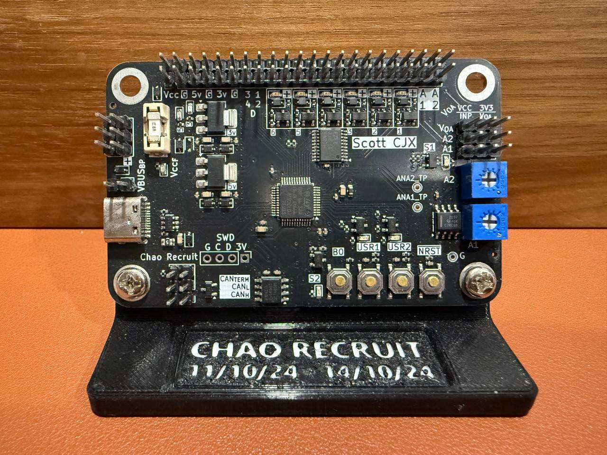

# Chao Recruit

This is a PCB that was designed by `Scott-CJX` for Nanyang Technological University's (NTU's) Nanyang Venture Formula (NVF) Racing team.

## Overview

The purpose of this board is to be used as a node in part of a larger network that spans NVF-2, NVF's Formula Student Electric Car.

## Main Features

- ARM processor: STM32F072, running at 48 Mhz
- USB C Port
- Wide Range of acceptable Voltage Input: 5V-16V + Fuse
- Intergrated CAN Bus Interface + Jumper to terminate CAN Bus line
- 6 Buffered MOSFET Outputs
- 2 OP-AMP Buffered Analogue Inputs

## Showcase

